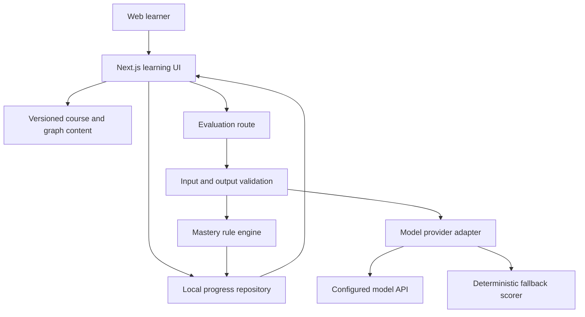

# Technical Design Document: 具身拼图 MVP

## Recommended Approach

**Primary approach: full-stack Next.js with AI assistance** — matches the user's Python and common-framework experience while maximizing two-day delivery speed.  
**Time to MVP:** 2 days for one complete demo path | **Learning curve:** moderate | **Cost:** free hosting plus capped model usage for the demo

### Approach Alternatives

| Approach | Pros | Cons | Decision |
|---|---|---|---|
| Next.js full-stack | UI and server API in one repo; easy environment variables and deployment; strong TypeScript ecosystem | More framework conventions than plain React | **Recommended:** AI endpoint needs a server boundary and the timeline favors one deployable app |
| React + Vite + separate Python API | Familiar Python backend; very fast frontend dev | Two services, CORS, two deployments and more setup | Good later if evaluation logic becomes Python-heavy; unnecessary for the two-day demo |
| Static HTML/React prototype | Fastest and can be hosted anywhere | Cannot safely call model APIs; risks looking like a static mock | Use only as fallback, not the primary build |

### Tech Stack (Balanced for Learning)

- **Frontend:** Next.js + React + TypeScript + Tailwind CSS — fast component iteration, predictable styling, shared client/server types
- **Knowledge graph:** React Flow — interactive nodes, edges, zoom, pan and custom node states
- **Backend:** Next.js route handlers — keeps model keys server-side and validates feedback output
- **Validation:** Zod — validates course data and model responses before UI use
- **Data:** versioned TypeScript/JSON content plus browser `localStorage` — fastest reliable path for a visitor demo
- **Deployment:** Vercel — one repository and preview deployments
- **AI assistant:** Codex as the primary coding agent; model provider selected through an adapter and environment variables

### Stack Alternatives

| Layer | Recommended | Alternative | Trade-off |
|---|---|---|---|
| App framework | Next.js | React + Vite | Vite is simpler for static UI; Next.js avoids a separate model proxy |
| Graph | React Flow | Mermaid / custom SVG | Mermaid is fast but less interactive; custom SVG gives control at much higher effort |
| Persistence | localStorage | Supabase | localStorage has no cross-device progress; Supabase adds setup and schema work not needed for the first demo |
| AI provider | provider-neutral adapter | hard-coded single SDK | An adapter costs a small amount of code but makes quality/cost comparison possible |
| Styling | Tailwind CSS | CSS Modules | Both work; Tailwind speeds consistent iteration, CSS Modules reduce utility-heavy markup |

## Project Structure

```text
jushen-puzzle/
├── src/
│   ├── app/
│   │   ├── api/evaluate/route.ts   # Server-side Agent evaluation endpoint
│   │   ├── learn/[nodeId]/page.tsx # Lesson and challenge route
│   │   ├── map/[domainId]/page.tsx # Detailed mind-map route
│   │   ├── page.tsx                # Global competency puzzle
│   │   ├── layout.tsx
│   │   └── globals.css
│   ├── components/
│   │   ├── graph/                  # Global and detailed knowledge maps
│   │   ├── lesson/                 # Visual lesson cards
│   │   ├── challenge/              # Game and Feynman interaction
│   │   └── progress/               # Evidence, state and unlock UI
│   ├── content/
│   │   ├── competency-map.ts       # Versioned nine-domain graph
│   │   ├── sensor-lesson.ts        # Complete demo lesson
│   │   └── robot-case.ts           # Source-backed application case
│   ├── lib/
│   │   ├── agent/                  # Provider adapter, prompts, fallback scorer
│   │   ├── mastery/                # Deterministic mastery rules
│   │   ├── schemas/                # Zod schemas and shared types
│   │   └── storage/                # localStorage progress repository
│   └── hooks/                      # Progress and responsive graph hooks
├── public/                         # Self-created diagrams and static assets
├── docs/                           # Research, PRD and technical design
├── agent_docs/                     # Build instructions generated in Part 4
├── .env.example                    # Names only; never real secrets
├── package.json
└── README.md
```

A feature-first layout keeps learning content, Agent logic and visual state separable. The future database adapter can replace local storage without rewriting the UI.

## Building Each Feature

### Feature 1: 岗位知识拼图 — Medium with React Flow

1. Define nine domains, prerequisites, positions, status and descriptions in `competency-map.ts`.
2. Render custom nodes with four states and a contextual detail panel.
3. Persist demo progress locally and update the graph reactively.
4. Test by opening the home page, zooming/panning, selecting nodes and refreshing after a status change.

**Learning points:** graph data modeling, controlled React state, status as derived data.

### Feature 2: 详细思维导图与图文微课 — Medium

1. Create the “感知与传感器 → 传感器选择” child graph.
2. Store lesson blocks as typed content: objective, analogy, visual, concept, misconception and product translation.
3. Build reusable content cards and progress navigation.
4. Test by navigating global map → detailed map → lesson with no dead ends.

**Learning points:** content schemas, reusable components, visual hierarchy.

### Feature 3: 互动挑战与费曼复述 Agent — Hard

1. Implement a constraint-based sensor selection game with deterministic correctness rules.
2. Add a Feynman response input and server-side `/api/evaluate` endpoint.
3. Ask the configured model for strict structured evidence across five rubric dimensions.
4. Validate output; on timeout, missing key or invalid JSON, use a transparent fallback scorer so the demo continues.
5. Test correct, partially correct, wrong, empty and provider-failure paths.

**Learning points:** server boundaries, structured model output, validation, graceful degradation.

### Feature 4: 掌握证据与拼图点亮 — Medium

1. Store challenge result, rubric evidence, attempts and critical errors.
2. Apply a deterministic gate: challenge passed, no critical misconception, and rubric threshold met.
3. Animate state transition and show the exact evidence that triggered it.
4. Test that refreshing retains progress and that a fluent but critically wrong answer does not unlock.

**Learning points:** domain rules, explainability, persistence.

### Feature 5: 真实机器人案例应用 — Medium

1. Present a bounded public-information case with environment, user and safety constraints.
2. Require the learner's analysis before feedback appears.
3. Link feedback to lesson nodes and sources.
4. Test that the user can submit, receive feedback and return to the updated global map.

**Learning points:** authentic assessment, traceable evidence, cross-screen state.

## Development Setup

1. Use the bundled Node.js runtime when available; otherwise install a current LTS Node release.
2. Scaffold Next.js with TypeScript, Tailwind CSS and the App Router.
3. Add React Flow and Zod; add only the selected model SDK or use standard `fetch` in the provider adapter.
4. Copy `.env.example` to `.env.local` only when testing a real model. The app must run without it.
5. Run lint, type-check, unit tests and production build before handoff.

## Simplified Architecture



**How it works:** The UI owns navigation and local progress. Curated content defines what can be learned. The server route sends only the current rubric, bounded lesson facts and learner answer to the configured model. The model extracts evidence; deterministic code decides whether the node unlocks.

**Key concepts:**

- The knowledge graph is the curriculum contract, not model-generated decoration.
- Evidence extraction and mastery decisions are separate.
- Provider failures never break the demo's core path.
- Course version and mastery record version travel together so future graph updates remain explainable.

## AI Features (Optional)

AI is optional for running the demo but central to its best experience.

### Use Cases

1. Evaluate free-form Feynman explanations against a fixed rubric.
2. Produce one adaptive follow-up question based on the learner's largest gap.
3. Re-explain one concept in simpler language using only approved lesson facts.
4. Give feedback on the final robot product analysis.

### Data Sensitivity

- Demo inputs are educational responses and are treated as private user content.
- Do not send API keys, browser metadata or unrelated conversation history to the model.
- Personal document upload is out of scope; it requires a separate consent and retention design.

### Provider Options

| Option | Pros | Cons | Use |
|---|---|---|---|
| High-quality hosted model | Best semantic feedback and Chinese explanation | Variable cost and network dependency | Default when an API key is configured |
| Lower-cost hosted model | Faster/cheaper for simple classification | May miss subtle causal errors | Candidate for challenge classification after evaluation |
| Local/open model | Data control and predictable infrastructure | Setup, hardware and quality tuning exceed two-day scope | Evaluate after product validation |

### Contract

The provider must return: `dimensionScores`, `evidenceQuotes`, `gaps`, `criticalMisconceptions`, `followUpQuestion`, and `nextAction`. Zod rejects missing or invalid fields. The route uses timeouts and never exposes provider error details or secrets to the browser.

### Latency, Cost and Fallback

- Target one model call per Feynman submission, with bounded lesson context and output length.
- UI shows an active evaluation state and allows safe retry.
- Cost is measured per completed learning loop, not per token in isolation.
- Without a key or on failure, a clearly labeled demo evaluator uses keyword, relationship and misconception rules; it must not pretend to be full semantic AI evaluation.

## Step-by-Step Implementation

- **Day 1 — Foundation and maps:** scaffold, design tokens, typed content, global puzzle, detailed mind map, lesson page and local progress.
- **Day 2 morning — Learning Agent:** challenge game, Feynman evaluation API, fallback scorer, evidence card and mastery gate.
- **Day 2 afternoon — Application and handoff:** real case task, unlock animation, responsive pass, tests, production build and deploy-ready instructions.

## Common Challenges & Solutions

- **Graph becomes visually crowded** → keep nine nodes on the overview and move detail into a second graph; do not render every leaf at once.
- **Model gives flattering but vague feedback** → require evidence quotes and critical-misconception flags; reject unstructured output.
- **Different runs produce different mastery** → keep the unlock gate deterministic and use the model only to extract evidence.
- **No API key during demo** → use the built-in labeled fallback path with representative preset responses.
- **Mobile graph is hard to operate** → switch to a focused node carousel/list below the desktop breakpoint while preserving the same data.

## Deployment Guide

### Deploy to Vercel (Recommended)

1. Push the repository to a Git host and import it into Vercel.
2. Add the selected provider key and model family name as environment variables; never prefix server secrets with `NEXT_PUBLIC_`.
3. Run the production build in CI or Vercel before promoting.
4. Test the no-key fallback deployment as a separate scenario.

**Alternatives:** Cloudflare Pages/Workers can reduce edge latency but may require runtime adaptations; a small container host supports a future Python service but adds operational work.

## Cost Breakdown

### Development Phase

| Service | Starting Tier | Notes |
|---|---|---|
| Codex | Existing tool access | Primary coding assistant |
| Vercel | Free/Hobby where eligible | Verify current usage and commercial terms before public launch |
| Model API | Usage based | Cap input/output and record cost per learning loop |
| Supabase | Not used in demo | Add only when cross-device accounts and progress are required |

**After launch:** Hosting and local data can remain low-cost for small testing. Model evaluation is the main variable cost. Confirm current vendor pricing before deployment and set spend alerts where available.

## Learning Resources

- Next.js App Router documentation
- React Flow quick start and custom-node guides
- Zod schema documentation
- Selected model provider's structured-output and security documentation
- Vercel environment-variable and deployment documentation

## Success Metrics

- [ ] Production build completes without type or lint errors
- [ ] The app runs with and without a model API key
- [ ] Global map → lesson → challenge → feedback → unlock → real case works end-to-end
- [ ] Mastery evidence survives refresh on the same browser
- [ ] A critical misconception blocks unlock even when the rest of the answer is fluent
- [ ] Main path remains usable on desktop and mobile
- [ ] No secret appears in client bundles, logs or committed files

## Maintenance

- Pin stable dependency ranges and commit the package lockfile.
- Review model quality and provider pricing monthly using the same evaluation set.
- Version curriculum content and rubric changes; never silently reinterpret old mastery records.
- Update `AGENTS.md`, architecture notes and `.env.example` whenever the stack or provider contract changes.
- Add a managed database only after the demo proves a need for accounts or cross-device progress.

## Open Questions

| Question | Current Default | Decision Trigger |
|---|---|---|
| Which hosted model best evaluates Chinese Feynman responses? | Provider-neutral adapter; start with one strong model available to the user | Run the fixed evaluation set before public beta |
| Which real robot is the launch case? | Use an illustrative warehouse mobile robot scenario backed by public robotics principles | Choose a branded case only after source and asset review |
| When should Supabase be introduced? | Not in two-day demo | Add when more than one device/user must retain progress |
| Should a Python evaluation service be added? | No | Add if analytics, offline processing or model experimentation becomes Python-heavy |

---
*Created for: 具身拼图 | Path: Full-stack AI-assisted learning | Est. time: 2 days*

---
## Handoff Context
<!-- Machine-readable summary for the next workflow step. Do not delete; the next prompt in the workflow reads it. -->
- Stage: techdesign
- App name: 具身拼图
- User level: C
- Target platform: web
- Budget: flexible; free hosting plus capped usage-based model API for demo
- Timeline: 2 days; target 2026-08-03
- Chosen stack: Next.js + React + TypeScript + Tailwind + React Flow + Zod + localStorage + Vercel
- AI coding tool: Codex
- Source files: research-具身拼图.md → PRD-具身拼图-MVP.md → TechDesign-具身拼图-MVP.md
---
