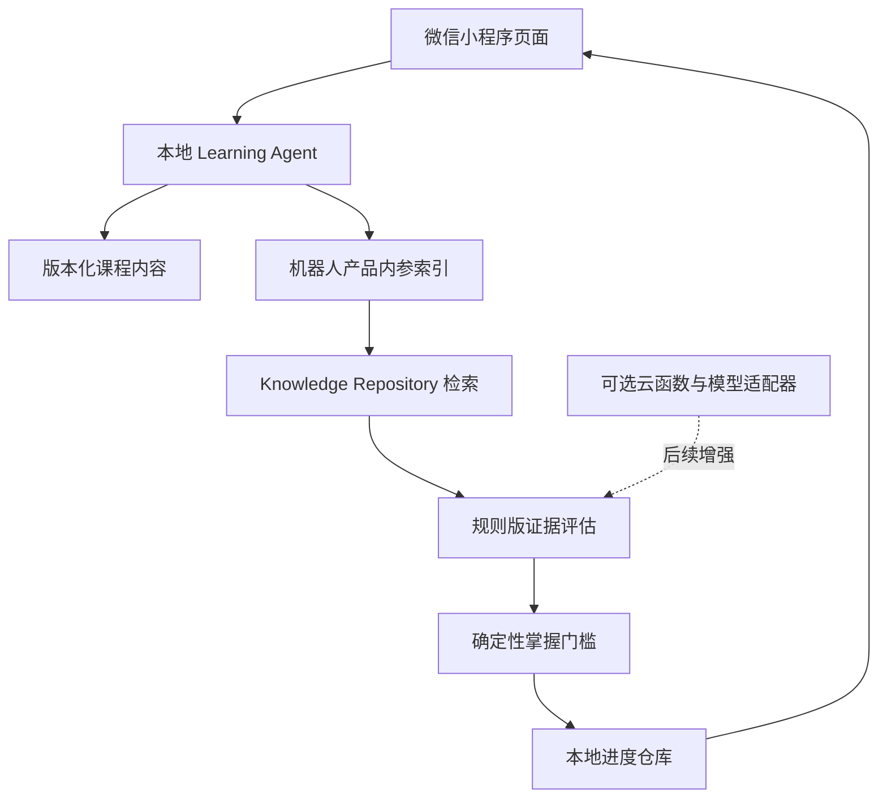

# Technical Design Document: 身知回响微信小程序 MVP

## Recommended Approach

**Primary approach: 微信原生小程序 + TypeScript + 本地优先业务核心** — 直接适配微信导航、触控和发布链路，同时复用现有产品内容与确定性掌握规则。

- **Time to MVP:** 当前迭代完成可导入版
- **Learning curve:** moderate
- **Cost:** 离线版无增量服务成本

### Alternatives

| 方案 | 优点 | 缺点 | 决策 |
|---|---|---|---|
| 微信原生小程序 | 运行链路短、包体可控、平台能力直接、适合四 Tab | UI 不能直接复用 React | **采用**：本次只做微信端且要求可直接使用 |
| Taro + React | 可复用 React 思维，未来多端 | 增加构建层、依赖和兼容排查 | 暂不采用；多小程序平台成为目标后再评估 |
| WebView 套现有 Web | 最快看到页面 | 交互、网络和审核体验差，无法体现原生 Tab | 不采用 |

### Tech Stack

- **Frontend:** 微信原生 WXML/WXSS + TypeScript
- **State:** 页面本地状态 + `wx` 本地存储适配器
- **Content:** 版本化 TypeScript 课程模块 + 从本地 DOCX 构建的“机器人产品内参”知识索引
- **Knowledge retrieval:** `KnowledgeRepository` 对 125 份文档、485 个知识块执行标签与关键词检索
- **Agent:** 本地 `LearningAgent` 编排知识检索、规则评估、追问和案例反馈；可选服务端模型适配器后置
- **Evaluation:** 纯 TypeScript 规则评估器与确定性掌握门槛
- **Testing:** Vitest 测试纯业务逻辑；独立 TypeScript 配置检查小程序代码
- **Tooling:** 微信开发者工具 + Codex
- **Backend/Database/Auth:** MVP 不使用

## Project Structure

```text
miniprogram/
├── app.ts / app.json / app.wxss
├── pages/
│   ├── home/          # 首页 Tab
│   ├── puzzle/        # 拼图 Tab
│   ├── challenge/     # 挑战 Tab
│   ├── profile/       # 我的 Tab
│   ├── lesson/        # 传感器微课
│   ├── feynman/       # 选择挑战、复述和反馈
│   └── case/          # 机器人案例迁移
├── core/
│   ├── content.ts     # 版本化课程与九域内容
│   ├── learning-agent.ts # 知识检索、评估与追问编排
│   ├── evaluator.ts   # 透明规则版评估器
│   ├── mastery.ts     # 确定性掌握门槛
│   └── types.ts       # 领域类型
├── knowledge/
│   ├── robot-product-internal.generated.ts # 运行时知识索引
│   └── knowledge-repository.ts # 检索、校验与来源回溯
├── services/
│   └── progress-repository.ts # wx 本地存储边界
├── styles/            # 可选共享样式片段
├── types/             # 最小微信运行时声明
├── AGENTS.md
├── MEMORY.md
├── agent_docs/
└── README.md
```

页面只负责展示和事件转发；课程、知识检索、Agent 编排、评估、掌握和存储分别独立，未来接模型或云同步时不重写页面。原始 DOCX 不进入小程序，小程序只读取构建生成的版本化索引。

## Building Each Feature

### Feature 1: 四 Tab 与首页 — Easy

1. 在 `app.json` 注册首页、拼图、挑战、我的四个原生 Tab。
2. 首页读取本地进度，提供继续学习和查看拼图入口。
3. 验证切换 Tab 后进度和导航正常。

### Feature 2: 九域拼图与微课 — Medium

1. 定义九个版本化能力域，仅开放感知节点。
2. 用 3×3 卡片适配小屏，不引入画布库。
3. 微课按目标、类比、决策步骤、误区和来源分块展示。

### Feature 3: 挑战、复述和反馈 — Medium

1. 约束式选择题由固定答案和解析判定。
2. 本地学习 Agent 先检索“机器人产品内参”，再由规则评估器抽取概念、因果、边界和误区证据。
3. 页面明确标注“本地知识 Agent · 知识库检索 + 规则评估”，展示命中证据、源文件和缺口。

### Feature 4: 掌握、点亮与本地保存 — Medium

1. 规则要求：挑战正确、无关键误区、覆盖核心维度。
2. 保存课程完成、尝试次数、结果和证据摘要。
3. 首页、拼图、挑战和我的从同一仓库派生状态。

### Feature 5: 案例迁移 — Medium

1. 展示合成仓储机器人场景、约束和候选方案。
2. 用户先选择并解释，再获得确定性反馈。
3. 保存案例完成状态并返回总览。

## Development Setup

1. 在根目录运行 `npm install`。
2. 使用微信开发者工具导入仓库根目录，`project.config.json` 指向 `miniprogram/`。
3. 默认 `touristappid` 用于本地预览；正式体验版替换为项目方 AppID。
4. 运行 `npm test`、`npm run lint`、`npm run typecheck` 和 `npm run typecheck:mini`。
5. 在微信开发者工具执行编译，并手工完成核心路径。

## Simplified Architecture



**How it works:** 页面将用户输入交给本地学习 Agent；Agent 调用知识库检索并组织上下文，评估器返回结构化证据；掌握门槛决定是否点亮；进度仓库把结果保存到微信本地。  
**Key concepts:** 知识来自本地内参索引；Agent 不改写知识；评估与点亮分离；没有云端时核心流程仍完整。

## AI Features (Optional)

- **Use case:** 自由复述的同义表达识别、证据抽取和针对性追问。
- **Data sensitivity:** 只发送当前课程事实、评分规程和用户回答；不发送微信身份或无关历史。
- **Provider:** 腾讯云 TokenHub 上的混元候选模型，经云函数调用。
- **Fallback:** 任何无 Key、超时、低置信或结构错误均回到规则版评估；规则仍最终决定点亮。
- **MVP decision:** 已实现不依赖模型的本地知识 Agent；在线模型仍未接入。

## Step-by-Step Implementation

- **Foundation:** 工程配置、类型、内容和本地仓库
- **Navigation:** 四 Tab、首页和拼图
- **Learning:** 微课、挑战和规则反馈
- **Mastery:** 点亮、证据、案例和重置
- **Verification:** 单元测试、类型、Lint、开发者工具检查说明

## Common Challenges & Solutions

- **根 TypeScript 配置误扫小程序全局变量** → 使用独立 `miniprogram/tsconfig.json`，根配置排除该目录。
- **规则评估漏掉自然语言同义词** → 显示命中依据、允许重试；使用词组集合而非单关键词。
- **本地进度被微信清理** → 明确本地保存；跨设备同步不伪装成已实现。
- **没有 AppID** → 使用 `touristappid` 本地导入，README 说明正式替换步骤。

## Deployment Guide

### 本地可用版

1. 安装微信开发者工具。
2. 导入仓库根目录或直接导入 `miniprogram/`。
3. 使用测试号/游客 AppID 编译。
4. 从首页完整跑通一次学习闭环。

### 体验版与正式版

1. 使用项目方 AppID 替换游客配置。
2. 在微信公众平台补齐主体、隐私说明和服务类目。
3. 上传体验版，真机验证存储、导航和常见屏幕。
4. 若接云函数，再配置环境 ID、服务端密钥、限流和合法域名。
5. 通过安全与隐私检查后提交审核。

## Cost Breakdown

| Service | MVP | Notes |
|---|---|---|
| 微信开发者工具 | 免费 | 本地开发与预览 |
| 本地存储和课程 | 免费 | 不需要数据库 |
| CloudBase | 不使用 | 真实模型或同步时再评估额度 |
| 模型 API | 不使用 | 后续按评测结果和调用量决定 |

## Learning Resources

- 微信小程序框架、全局配置、页面和本地存储官方文档
- TypeScript Handbook
- Vitest 官方文档
- 项目内课程来源台账和评分规程

## Success Metrics

- [ ] 微信开发者工具可导入且页面配置完整
- [ ] 四 Tab、微课、挑战、复述、点亮和案例可完整运行
- [ ] 无模型 Key 和无数据库时不阻塞
- [ ] 核心规则单元测试、Lint 和类型检查通过
- [ ] 进度重启后恢复，重置后清空
- [ ] 仓库中没有真实 AppID 密钥、模型 Key 或个人信息

---
*Created for: 身知回响微信小程序 | Path: Native offline-first | Est. time: current iteration*

---
## Handoff Context
<!-- Machine-readable summary for the next workflow step. Do not delete; the next prompt in the workflow reads this block. -->
- Stage: techdesign
- App name: 身知回响微信小程序
- User level: C
- Target platform: WeChat native mini program
- Budget: offline MVP has no incremental service cost
- Timeline: immediately deliver an importable local MVP; trial release after AppID is available
- Chosen stack: WeChat native WXML/WXSS + TypeScript + wx local storage + Vitest; no backend/database for MVP
- AI coding tool: Codex
- Source files: research-具身拼图.md → PRD-具身拼图微信小程序-MVP.md → TechDesign-具身拼图微信小程序-MVP.md
---
