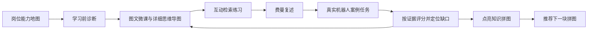
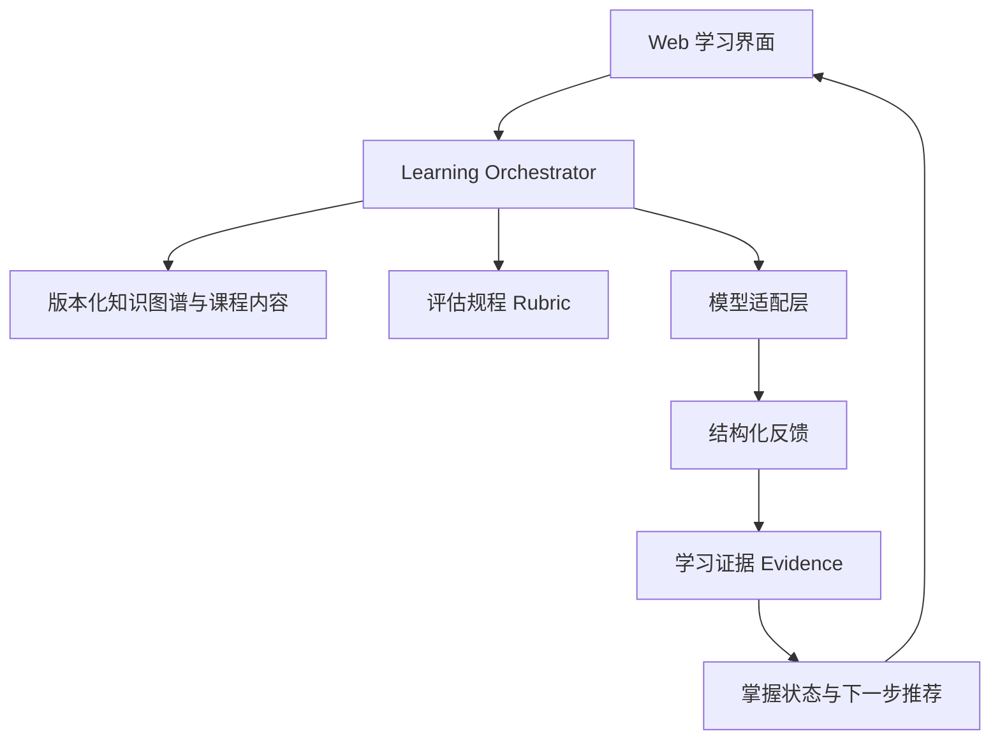

# 1. Project name

## 具身拼图（暂定名）

一个面向复杂行业学习的 AI 教育 Agent：以岗位能力知识图谱为骨架，用图文讲解、互动挑战、费曼复述和真实项目任务，持续回答用户三个问题——“我该学什么”“我是否真的学会”“我能否用于真实工作”。首个垂直方向是具身智能产品经理。

调研日期：2026-08-01。

# 2. Core concept

## 产品要解决的问题

目标用户已经看过不少 AI、机器人和具身智能材料，但知识是零散的。他们通常面临：

- 不知道一个具身智能产品经理应覆盖哪些知识领域，以及先后关系。
- 能认出概念，却不能用自己的话解释，也无法迁移到产品判断。
- 无法判断自己“学得够不够”，课程完成率不能证明岗位胜任力。
- 没进入行业时，很难凭空构造一个合理项目，更无法发现自己设计中的错误。
- 普通聊天机器人容易直接给答案，最后完成任务的是 AI，而非学习者。

## 核心闭环

产品不能把“完整”定义为看完一个固定目录。更可信的定义是：围绕一个目标岗位，建立有来源、可版本化的能力图谱；每个节点包含前置关系、理解层级、评估标准和真实任务证据；用户能看到已掌握、待加强、未覆盖和因行业变化而新增的节点。

建议采用四级掌握度：

1. **识别**：能辨认术语与作用。
2. **解释**：能用简单语言讲清原理、边界和常见误区。
3. **判断**：能在给定约束下比较方案并说明取舍。
4. **应用**：能在真实机器人案例中完成产品分析，并让结论回溯到证据。

## 为什么现在值得做

- 现有 AI 学习产品已验证“对话辅导、分层解释、图文材料和自动测验”可以组合成学习体验。Google Learn About 支持图文解释、误区卡片、测试题和互动指南；Google Learn Your Way 进一步展示了把资料改编成思维导图、音频课和互动测验的方向（[Google Learn About](https://support.google.com/websearch/answer/15662709?hl=en)，[Google Learn Your Way](https://blog.google/products-and-platforms/products/education/learn-your-way/)，访问于 2026-08-01）。
- 具身智能知识天然跨学科。NVIDIA 对 Physical AI 的公开材料用“感知、规划、行动”描述机器人闭环，并把仿真、合成数据、机器人学习、软件在环和硬件在环纳入实际工作流。这说明只教孤立 AI 概念不足以支持产品工作（[NVIDIA Robotics Simulation](https://www.nvidia.com/en-us/use-cases/robotics-simulation/)，[Isaac Sim Learning](https://docs.nvidia.com/learning/physical-ai/getting-started-with-isaac-sim/latest/index.html)，访问于 2026-08-01）。
- 学习机制有研究基础。自我解释能促进理解；检索练习可用于巩固并检验学习。但“费曼复述”不能只靠大模型给一个模糊分数，必须用要点覆盖、因果关系、边界条件、误区和迁移任务组成的评分规程（[Chi et al., 1994](https://onlinelibrary.wiley.com/doi/10.1207/s15516709cog1803_3)，[Knowledge Tracing Survey](https://arxiv.org/abs/2201.06953)，访问于 2026-08-01）。

## 两天 Demo 的可验证假设

**核心假设：** 当用户完成一条学习分支后，如果系统能同时展示“知识节点变亮”和“真实产品分析能力提升的证据”，用户会认为这比单纯课程目录或聊天问答更能消除学习焦虑。

两天内不验证“是否能教完整个具身智能行业”，只验证以下最小闭环：

1. 用户看到具身智能产品经理的总知识拼图。
2. 进入一条可学习分支，例如“感知系统 → 传感器选择”。
3. 看一节包含示意图、类比、关键点和误区的微课。
4. 完成一个互动选择任务和一次费曼复述。
5. Agent 用明确规程反馈缺口，而不是只说“回答得不错”。
6. 用户重新作答后点亮拼图。
7. 用户在一个真实机器人案例中说明感知方案及其产品取舍。

建议首个案例使用公开资料充分、场景直观的移动或四足机器人；正式定案需在 PRD 阶段根据资料可用性、版权和演示观感选择具体产品。

# 3. Target users

## 首版用户

首版聚焦 C 类学习者：会使用 Python 和常见 AI 工具，有一定技术或产品基础，可以借助 AI 完成 MVP；接触过具身智能，但知识零散、理解不深，尚不能稳定完成具身智能产品分析。

他们最需要的不是更多资料，而是：

- 一张有边界、有前置关系的岗位能力地图。
- 把技术概念翻译成产品决策语言。
- 基于真实资料和约束的练习，而非凭空编项目。
- 能解释“为什么判定掌握/未掌握”的反馈。
- 将自己的产品文档变成训练材料，但避免 Agent 直接代写。

## 后续用户分层

| 人群 | 学习入口 | 内容与评估差异 |
|---|---|---|
| A：零基础跨行者 | 从行业、场景和基础概念开始 | 少术语、多类比；先识别与解释，再进入方案判断 |
| C：有基础的产品/复合型人才 | 从诊断与真实产品拆解开始 | 重点补齐跨学科连接、方案取舍和产品应用 |
| B：技术深入型学习者 | 从算法、系统与工程约束开始 | 要求公式、代码、论文、实验设计和系统性能判断 |

通用化应建立在同一份“领域知识图谱 + 不同难度教学表现 + 不同岗位评分规程”上，而不是给 A/B/C 分别维护三套互不相干的课程。

## 初版岗位能力地图建议

总地图建议先展示九个一级拼图，PRD 阶段再确定节点数量与解锁关系：

1. 行业与产品场景
2. 机器人本体与硬件
3. 感知与传感器
4. 定位、建图与世界模型
5. 规划、决策与任务编排
6. 控制、执行与安全
7. 数据、训练与评估
8. 仿真、部署与系统工程
9. 产品定义、商业化与项目交付

这不是“行业知识全集”，而是面向具身智能产品工作的初版能力框架。每个节点必须标注来源、更新时间、岗位相关性、前置节点和可证明的学习产物。

# 4. Technical decisions (if any)

## 研究阶段建议

两天 Demo 应做成可分享的 Web 应用。优先实现视觉和学习状态闭环，暂不建设完整的多智能体平台。

| 决策 | 首版建议 | 理由 |
|---|---|---|
| 知识地图 | React/Next.js + React Flow | React Flow 提供节点、连线、缩放、拖动、Minimap 和自定义节点，适合制作可交互拼图（[官方文档](https://reactflow.dev/)，访问于 2026-08-01） |
| 课程内容 | 一条人工策划并审核的 JSON/Markdown 内容链 | 两天内让模型动态生成整个课程会放大事实错误和评价漂移；先证明交互闭环 |
| Agent | 单一编排器 + 结构化输出 | 学习、出题、复述评分和推荐下一步可用不同提示模板；首版无需多个自主 Agent 相互调用 |
| 模型 | 模型适配层，首版只接一个高质量模型 | 便于后续用相同测试集比较模型的事实性、教学反馈和成本，不把业务逻辑绑死在供应商上 |
| 评估 | 规则评分为主，LLM 负责语义证据抽取 | 维度与阈值固定，模型输出“覆盖了什么/遗漏什么/证据句”，避免只返回不可解释总分 |
| 数据 | Demo 先用本地状态或轻量数据库 | 若需要登录和跨设备进度，可用 Supabase 免费档；官方当前免费档可支持小型演示（[Supabase Pricing](https://supabase.com/pricing)，访问于 2026-08-01） |
| 部署 | Vercel 或同类前端托管 | 适合快速生成可分享链接；正式产品再根据模型代理、数据地域和中国大陆访问要求调整 |

建议的数据对象最少包括：`competency_node`、`lesson`、`challenge`、`rubric`、`evidence`、`mastery_state`、`source` 和 `case_project`。图谱结构与教学文本必须分离，这样未来才能把首个领域从具身智能扩展到其他行业。

## Agent 最小架构

首版不建议让大模型决定整个图谱是否“完整”。图谱应由策划内容和来源构成；模型只负责在限定节点内讲解、追问、抽取用户回答证据和生成个性化反馈。

## 模型评测优先于模型品牌

用 10—20 条固定测试案例比较候选模型：

- 能否严格按 JSON Schema 输出。
- 能否识别“术语说对但因果关系错误”。
- 是否会在用户答错时直接泄露完整答案。
- 能否引用给定资料，而非补充无来源事实。
- 中文解释是否自然、简洁、适合 C 类用户。
- 单次完整学习循环的延迟与成本。

模型价格变化快，不应在产品逻辑中写死。作为当前量级参考，Anthropic 官方定价页显示 Claude Sonnet 5 在 2026-08-31 前为每百万输入/输出 token 2/10 美元，此后为 3/15 美元；更便宜的 Haiku 档适合低风险分类任务，但关键评估仍需先做质量测试（[Claude API Pricing](https://platform.claude.com/docs/en/about-claude/pricing)，访问于 2026-08-01）。这只是候选参考，不代表最终选型。

# 5. Competitor insights

## 竞品与替代方案

| 产品/替代方案 | 已验证的强项 | 对本项目的启发 | 可利用的空缺（基于公开功能的推断） |
|---|---|---|---|
| roadmap.sh | 用可视化路线图回答“学什么、按什么顺序学” | 总知识拼图必须一眼看懂，并支持路径与进度 | 更偏开发技能路线；公开首页未体现以真实岗位产物证明掌握（[官网](https://roadmap.sh/)，访问于 2026-08-01） |
| Brilliant | 短小互动课程、即时反馈、游戏化进度；覆盖数学、科学、计算机和 AI | 每个节点必须“边做边学”，而非长文章 | 课程范围与内容由平台预设；未体现用户上传行业文档后进行岗位能力迁移（[官方 FAQ](https://brilliant.org/faq/)，访问于 2026-08-01） |
| Khanmigo / Khan Academy | 引导式辅导、练习、反馈和掌握度；强调不直接给答案 | Agent 应追问和搭脚手架；掌握状态需基于历史练习 | 主要围绕学校学科与既有 Khan 内容，非具身智能岗位能力图谱（[官方介绍](https://blog.khanacademy.org/ai-tutor-tutoring-khanmigo-kl/)，[课程掌握度示例](https://www.khanacademy.org/khanmigo-for-educators)，访问于 2026-08-01） |
| Google Learn About / Learn Your Way | 图文、多种表现形式、思维导图、互动测验和个性化 | 证明用户确实期待“同一知识的多模态解释” | 重点是理解材料或主题；公开描述未体现岗位级能力地图和真实工作交付物评分（[官方帮助](https://support.google.com/websearch/answer/15662709?hl=en)，访问于 2026-08-01） |
| Mindgrasp | 把 PDF、幻灯片、音视频转成笔记、摘要、测验和闪卡 | 后续上传个人文档是合理扩展方向 | 内容转换强，但自动题目不等于岗位胜任力评估；公开功能未显示跨资料能力图谱（[官方工具页](https://www.mindgrasp.ai/ai-study-tools)，访问于 2026-08-01） |
| NVIDIA Isaac 学习内容 | 真实机器人技术工作流、仿真、传感器、ROS 2、SIL/HIL 等权威材料 | 可作为技术节点来源和真实约束参考 | 偏技术平台与工程学习，不解决非技术/产品岗位的跨学科翻译与能力追踪（[官方课程](https://docs.nvidia.com/learning/physical-ai/getting-started-with-isaac-sim/latest/index.html)，访问于 2026-08-01） |
| 通用大模型聊天 | 灵活、低门槛、能解释任何问题 | 对话是必要交互层 | 缺少稳定课程边界、版本化图谱、统一评分规程和可累计学习证据 |

竞品没有证明“市场上无人做”，但说明机会位于这些能力的交叉处：

> 岗位能力地图 × 多模态微课 × 可解释掌握评估 × 真实行业案例 × 个人文档迁移。

## 用户会喜欢什么

从竞品公开功能可以较高信心推断：可视化路线、即时反馈、短互动、个性化讲解和可见进度已经是被反复采用的体验模式。首版应保留这些成熟模式，同时把“掌握度”从做题百分比升级为有证据的岗位能力。

## 主要风险

1. **伪完整性**：漂亮地图可能让用户误以为覆盖了整个行业。必须显示版本、来源、岗位边界和更新时间。
2. **评估幻觉**：大模型可能被流畅表达欺骗。需要固定评分规程、证据句、关键错误拦截和重试机制。
3. **内容可信度**：动态生成技术内容可能过时或无依据。核心节点应人工策划并引用一手资料。
4. **游戏化喧宾夺主**：点亮拼图只能奖励真实证据，不能奖励点击和阅读时长。
5. **两天范围失控**：全图、全课程、上传文档、复杂 RAG、多模型和完整账户体系不能同时完成。
6. **“AI 代做”反学习**：训练流程应先让用户提交判断，再分层提示；最终答案只在复盘阶段展示。

# 6. Budget/timeline

## 两天演示计划

| 时间 | 目标 | 可验收结果 |
|---|---|---|
| 第 1 天上午 | 确定知识拼图、首章内容、真实案例和评分规程 | 可审阅的结构化内容数据 |
| 第 1 天下午 | 完成总地图、节点详情和章节学习页面 | 用户能从总图进入详细思维导图并学习 |
| 第 2 天上午 | 完成互动题、费曼复述和结构化反馈 | 用户回答后能看到明确缺口并重试 |
| 第 2 天下午 | 完成点亮动画、下一步推荐、案例任务和部署 | 从学习到点亮再到案例应用全流程可演示 |

## MVP 范围

**必须有：**

- 九个一级拼图的全局地图。
- 一个分支的详细思维导图。
- 一节图文微课。
- 一个互动挑战。
- 一次费曼复述与可解释评分。
- 一次真实机器人案例应用。
- 拼图状态变化和下一步推荐。

**两天版明确不做：**

- 全部节点的完整课程内容。
- 自动生成并发布未经审核的行业知识图谱。
- 复杂多智能体自治。
- 完整 RAG 数据管线和向量数据库。
- 正式账号、支付、社交、排行榜。
- 自动将用户文档生成完整 PRD；只在后续版本加入“先作答、再反馈”的文档训练。

## 成本估算

- 前端与部署：演示期可从免费档开始；实际免费额度和中国大陆访问体验需部署前实测。
- 数据：无登录 Demo 可使用浏览器本地状态，成本接近 0；需要云端进度时可从 Supabase 免费档开始，生产档当前从 25 美元/月起（[官方定价](https://supabase.com/pricing)，访问于 2026-08-01）。
- 模型：按调用量计费。建议为每次学习循环设置 token 上限、缓存固定课程上下文，并记录真实用量；在拿到 20—50 次演示数据前不预购复杂基础设施。
- 内容：首版最主要成本不是云服务，而是能力图谱、案例资料和评分规程的人工审核时间。

合理预期是两天完成“可演示的产品假设”，而不是可公开规模化运营的教育产品。演示成功标准是：至少一位目标用户无需讲解即可跑通闭环，并能明确说出“哪个知识点因为什么证据被点亮”。

---
## Handoff Context
<!-- Machine-readable summary for the next workflow step. Do not delete; the next prompt in the workflow reads this block. -->
- Stage: research
- App name: 具身拼图
- User level: C
- Target platform: web
- Budget: flexible; decide after model-quality and deployment tests
- Timeline: 2 days for a shareable end-to-end demo
- Source files: research-具身拼图.md
---
