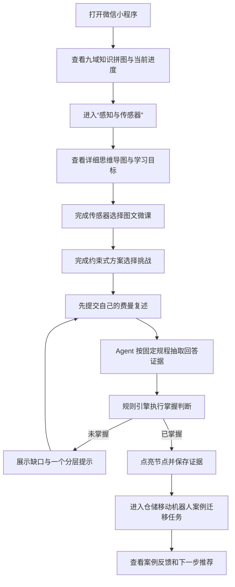
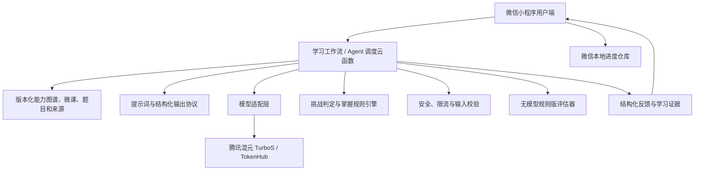

# 具身拼图微信小程序：产品与技术决策稿

**状态：** 已确认并进入实现  
**版本：** 0.1  
**日期：** 2026-08-03  
**范围：** 微信小程序 MVP，只跑通“感知与传感器 → 传感器选择”一条完整学习路径；复用现有 Web 端九域能力图谱、课程内容、评分规程和掌握规则。

## 2. 场景痛点

### 核心用户

有一定产品或技术基础、已经接触过 AI 和具身智能，但机器人知识零散，希望转向或胜任具身智能产品工作的学习者。

### 核心场景痛点

这类学习者常在通勤、午休或工作间隙，用 8—15 分钟阅读公众号文章、观看课程片段或向通用大模型提问。他们目前靠收藏资料、记笔记、看课程完成率和继续追问大模型判断学习进展，但这些方式没有统一的岗位能力边界，也不能证明自己是否能解释概念、比较方案并迁移到真实机器人产品决策中。

因此，用户虽然投入了大量时间，仍然不知道“该学什么、是否真的学会、能否用于工作”；知识长期停留在术语识别层，面试、需求分析或机器人方案评审时难以说明传感器选择的依据、边界和取舍，最终造成重复学习、转岗焦虑和实际决策风险。

### 为什么现有方式不够好

| 现有方式 | 能解决什么 | 不足 |
|---|---|---|
| 文章、视频、课程 | 获得知识和案例 | 内容按作者组织，不等于岗位能力地图；“看完”不能证明掌握 |
| 笔记、思维导图 | 整理个人理解 | 依赖用户自己判断对错，没有统一评分规程和迁移任务 |
| 通用大模型问答 | 快速解释和追问 | 容易直接给答案；反馈不稳定；没有版本化课程边界和累计证据 |
| 题库或选择题 | 检查术语和局部概念 | 很难验证因果解释、边界条件和真实产品取舍 |

### 小程序形态的价值

微信小程序不是 Web 页面的简单缩小版。它承担“随时进入一次短学习闭环”的角色：用户无需安装新应用，从知识拼图进入一个节点，在碎片时间内完成学习、作答、复述、反馈和点亮，并在下次进入时继续看到掌握证据。

### 已确认的一级导航

小程序首版采用四个原生 Tab。Tab 只承载稳定的一级入口，微课、作答和反馈等连续任务使用二级页面完成，避免把学习闭环拆散。

| Tab | 核心任务 | 主要内容 |
|---|---|---|
| 首页 | 快速继续学习 | 今日学习、当前进度、继续上次学习、下一步推荐 |
| 拼图 | 查看能力全图 | 九大能力域、节点状态、前置关系、推荐路径 |
| 挑战 | 检验和迁移知识 | 互动挑战、费曼复述、待重试任务、机器人案例 |
| 我的 | 查看累计证据 | 掌握证据、学习记录、内容版本、隐私与设置 |

节点详情、详细思维导图、图文微课、挑战作答、Agent 反馈和案例详情均为二级页面，不占用底部 Tab。首版使用微信原生 TabBar；只有在视觉验证表明原生样式无法表达核心品牌体验时，才考虑自定义 TabBar。

## 3. 交互流程

### 完整主流程

### 关键交互原则

- 参考答案在用户首次提交前不可见。
- Agent 只指出证据、缺口和追问，不替用户完成答案。
- 节点是否点亮由确定性规则决定，模型不能直接解锁。
- 每个点亮状态都能展开查看“哪次作答、哪些证据、哪条规则”触发了结果。
- 小程序端默认采用单列卡片、分步页面和底部主操作，知识图谱在小屏上切换为聚焦节点列表，不照搬桌面无限画布。

### 异常流程

| 异常 | 用户看到什么 | 系统如何处理 |
|---|---|---|
| 网络不可用或请求超时 | “当前网络不可用，可继续学习固定课程，稍后再评估” | 课程和挑战使用本地版本；保存未提交答案；恢复网络后允许重试 |
| 模型不可用、无 Key 或输出格式错误 | 明确标注“当前使用规则版演示评估” | 使用关键词、关系和关键误区规则评分；不伪装成完整语义评估 |
| Agent 对回答判断不确定 | 显示“证据不足，暂不点亮”及一个澄清问题 | 不解锁节点；让用户补充因果或边界说明后重新评估 |
| 课程库没有对应内容 | 显示“该节点正在审核，暂不可学习” | 不让模型临时编课程；记录内容缺口，推荐已审核的相邻节点 |
| 用户不接受推荐或评分 | 提供“查看评分依据”“重新作答”“暂时跳过” | 保留原始证据和规则版本；用户可重试，但不能手动强制点亮 |
| 回答包含敏感或无关内容 | 给出简短安全提示 | 停止模型调用或过滤内容；不保存不必要的敏感信息 |
| 本地进度写入失败 | 提示“本次进度尚未保存” | 当前会话保留结果，并提供再次保存；不误报成功 |

## 4. 技术路线

### 推荐架构

### 为什么需要 Agent

选择题可以由程序直接判定，但费曼复述和案例分析存在多种正确表达。Agent 的价值是：在固定课程事实和评分规程内，识别用户回答覆盖了哪些概念、因果、边界、误区和迁移证据，并根据最大缺口选择一个追问。它不是自由浏览互联网或自主制定课程的通用 Agent，而是受有限状态工作流约束的学习编排器。

### Agent 如何规划与执行

1. 读取当前节点、课程版本、用户本次回答和固定评分规程。
2. 判断任务类型是“复述评估”还是“案例迁移反馈”。
3. 从批准的课程事实中检索本题需要的最小上下文。
4. 调用模型抽取结构化证据；模型不得修改评分阈值。
5. 校验模型结果结构、证据句和风险标记。
6. 将有效证据交给规则引擎，由程序决定是否掌握。
7. 保存证据、规则版本和结果，并返回下一步操作。

### 模型、规则和工具的边界

| 任务 | 决策方式 | 原因 |
|---|---|---|
| 识别自由文本中的同义表达和因果证据 | 模型 | 表达形式多，纯关键词容易漏判 |
| 生成一个针对最大缺口的追问 | 模型，受课程事实约束 | 需要根据用户回答自适应 |
| 课程目录、知识事实、参考答案和来源 | 人工审核的版本化内容 | 防止模型重新定义课程或生成未审事实 |
| 选择题正确性、前置条件、评分阈值和点亮 | 规则或程序计算 | 需要稳定、可测试、可解释 |
| 读取课程片段和评分规程 | 受限内容检索工具 | 只提供当前任务所需上下文，降低幻觉 |
| 网络搜索、通用 RAG、用户文件上传 | 小程序 MVP 不调用 | 数据授权、质量和两天范围均不支持 |

### 如何降低幻觉和错误

- 仅把当前节点的已审核事实、评分规程和用户回答发送给模型。
- 要求模型按固定 JSON 结构返回分项证据、缺口、关键误区和置信状态。
- 服务端校验结构；缺字段、引用不存在或超时即走降级流程。
- 关键误区采用程序硬拦截，流畅表达不能绕过。
- 用户可查看内容来源、课程版本和判定依据。
- 建立固定评测集，对正确、部分正确、术语正确但因果错误、空回答和提示注入进行回归测试。

## 5. 数据来源

### MVP 数据清单

| 数据 | 来源与性质 | 授权和展示方式 |
|---|---|---|
| 具身智能与机器人基础事实 | NVIDIA、ROS 2、传感器厂商等公开的一手技术资料 | 记录标题、URL、访问日期和适用版本；只做必要转述和短引用 |
| 九域能力图谱 | 项目根据目标岗位整理的自有策划内容 | 标注为“初版岗位能力框架”，不宣称是行业唯一标准 |
| 微课、题目、评分规程 | 项目团队基于公开资料原创并人工审核 | 版本化保存，可追溯到所依据的资料 |
| 示意图和页面素材 | 自制图形、可商用或明确授权素材 | 不直接搬运厂商受版权保护的产品图 |
| 仓储移动机器人案例 | 基于公开机器人原理构造的合成案例 | 明确标注“教学用合成案例，不代表某真实企业项目” |
| 用户作答和学习进度 | 用户在 Demo 中产生 | 默认只保存在微信本地存储，不收集姓名、手机号或通讯录 |

### 清洗与标注流程

1. 建立来源台账，记录资料所有者、URL、版本、访问日期和使用许可状态。
2. 将资料拆成最小事实单元，删除营销性结论和无法交叉验证的数字。
3. 为事实标注所属知识节点、难度、前置知识、适用场景和边界条件。
4. 由人工把事实转成微课、题目、误区和评分规程；模型只能辅助排版，不作为事实来源。
5. 发布前进行事实、版权和教学三类审核，并生成内容版本号。

### 个人信息与 Demo 数据

- 首版不要求微信授权登录，不读取头像、昵称、手机号、位置、通讯录或相册。
- 用户自由文本可能主动包含个人信息，界面需提醒不要提交敏感信息，并在服务端限制日志内容与保存时间。
- Demo 使用合成用户答案、合成案例和匿名本地进度，必须在界面和项目文档中明确标注。
- 若后续启用跨设备进度或 OpenID，再单独设计隐私告知、同意、删除和保留期限；不在本 MVP 中提前收集。

## 6. 模型与工具

### 模型选择

**首选候选：** 腾讯混元 TurboS 系列，通过腾讯云 TokenHub 的 OpenAI 兼容接口在服务端调用。选择理由是中文教学反馈、微信/腾讯云部署链路和中国大陆网络可用性更匹配小程序场景。正式锁定调用名之前，必须用同一组 10—20 条中文复述样例完成质量、延迟、结构稳定性和成本测试。

### 模型职责

- 从自由文本中抽取五类学习证据：概念、因果、边界、误区、迁移。
- 标出缺失点和可能的关键误区。
- 在证据不足时生成一个澄清问题。
- 对机器人案例回答给出基于已审核事实的反馈。

模型不负责生成课程事实、修改题目答案、决定评分阈值或点亮节点。

### 是否使用多模型和知识库

- MVP 只使用一个模型，避免增加路由、评测和故障排查成本。
- 已接入本地“机器人产品内参”：125 份 DOCX 只读抽取为 485 个版本化知识块，由 `KnowledgeRepository` 按节点、标签、标题和关键词检索。
- MVP 不建立向量数据库，也不做开放式 RAG；当前内容量小，精确按节点检索更稳定且可解释。

### 接口、提示词、工作流和结构化输出

- 小程序通过云函数调用评估接口，模型密钥只存在云端环境变量中。
- 提示词按任务版本化：`feynman-evaluation`、`case-transfer-feedback`、`gap-follow-up`。
- 返回结构固定包含：分项证据、证据原句、缺口、关键误区、置信状态、追问和建议动作。
- 服务端用 Zod 校验外部输入和模型输出；不合格结果不进入掌握规则。
- 工具仅包括课程片段读取、评分规程读取、进度读写和安全检查；首版不开放任意搜索或代码执行。

### 降级策略

1. 模型正常：返回语义证据，规则引擎判断掌握。
2. 模型低置信：不点亮，返回一个澄清问题。
3. 模型超时、限流、无 Key 或结构失败：切换为明确标注的“规则版演示评估”。
4. 规则版也无法判断：保存答案，提示稍后重试；绝不默认通过。

## 7. 部署方式

### 推荐部署形态

采用“小程序前端 + 腾讯云云函数 + 本地进度”的轻量云端部署：

| 层 | MVP 选择 | 说明 |
|---|---|---|
| 用户端 | 微信原生小程序 + TypeScript | 适配微信交互和小屏体验，避免把 Web 页面直接套 WebView |
| 后端 | CloudBase/腾讯云 Node.js 云函数 | 负责输入校验、Agent 工作流、模型代理、限流和降级；密钥不进入客户端 |
| 数据库 | 不使用数据库 | 进度保存在 `wx` 本地存储；课程随版本化内容包发布 |
| 模型 | 腾讯云 TokenHub 上的混元 TurboS 候选 | 通过服务端适配层调用，调用名通过评测和账号可用性最终确认 |
| Web 端 | 保留现有 Next.js + Vercel | 与小程序共享课程 schema、内容版本和掌握规则，不共享页面组件 |

腾讯云提供面向小程序的 CloudBase 客户端和云函数能力；如果改为自建 HTTPS API，则还需要在小程序后台配置合法请求域名。正式发布前还需完成小程序账号主体、AppID、隐私声明、服务器域名和平台审核。

### 环境配置

- `development`：微信开发者工具，本地/测试云环境，默认不开模型也能完成流程。
- `trial`：微信体验版，连接测试云函数和合成示例数据，用于演示和 5 位目标用户测试。
- `release`：微信正式版，连接生产云环境；需完成隐私、域名、配额、日志和安全检查后才能提交审核。
- 仅在云端配置模型 API Key、模型名、超时和限流；仓库只保留 `.env.example` 的变量名，不保存真实值。

### Demo 启动步骤

1. 安装依赖，并在微信开发者工具中导入小程序目录。
2. 填入项目 AppID 和测试 CloudBase 环境 ID。
3. 如需真实模型评估，在云函数环境变量中配置 TokenHub Key 和已通过评测的模型名；不配置则自动使用规则版演示评估。
4. 部署云函数，编译小程序，依次验证正常模型、无 Key、断网和低置信回答。
5. 上传体验版并生成体验二维码；正式发布需另行提交微信审核。

### 交付物

- 微信小程序源码、云函数源码和共享内容包。
- `.env.example`、README、架构说明、数据来源台账和隐私说明草案。
- 无需登录的访客 Demo、三组预设学习答案和一个合成机器人案例。
- 正常、错误、低置信、无模型和离线场景测试说明。
- 体验版二维码由具备 AppID 和相应权限的项目账号生成；文档不虚构测试账号。

## 已确认的产品边界

微信小程序与现有 Web 端面向同一类中级学习者，首版只完成“感知与传感器”一条路径。2026-08-03 已确认首页、拼图、挑战、我的四个原生 Tab；如未来改为面向零基础用户，需要重新定义课程深度、首屏引导、评分规程和主流程，不能只调整文案。
